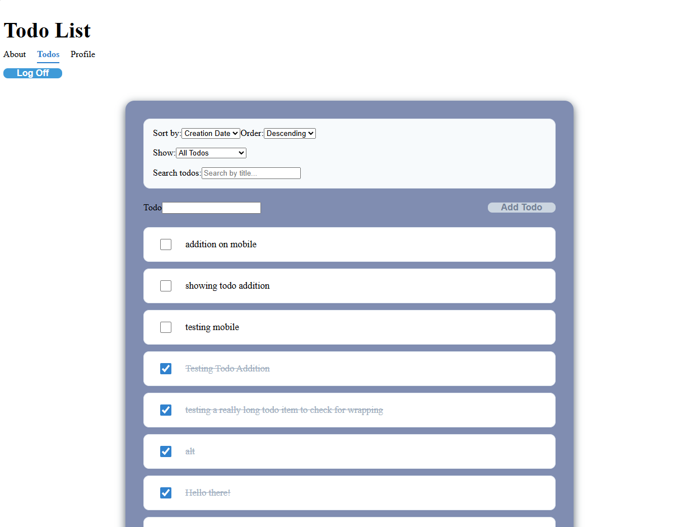
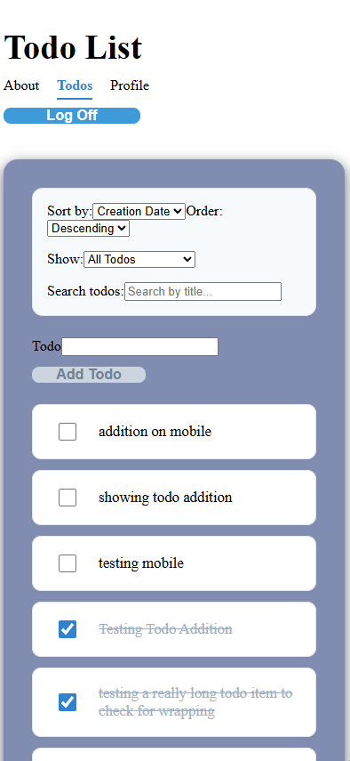

# Code the Dream Todo List

## Overview  
This is a Todo management application built with React 18 and Vite 7.
This application features CRUD functionality, dynamic client-side filtering,
and asynchronous caching state patterns. It is polish with custom styling
architecture, mobile-first responsive design, and client-side security measures.  

## Live Demo Link
Live Deployed Site: [Vercel Deployment](ctd-todo-list-e4u5jc4xx-kennyli6s-projects.vercel.app)  
Video Demo: [Youtube Video](https://youtu.be/3oITGtOjCcI)  

## Features List  
- Adding todos
- Mark todos complete
- Edit todos
- Sort list by date or title
- Filter list for searched term
- User Authentication

## Technologies Used  
- Vite
- React 19.2.4
- React Router 7
- CSS Modules
- DOMPurify
- ESLint

## Screenshots  
  
  

## Getting started  
To install, clone this repository.  

To run the development server, use 'npm run dev' in a terminal while in the ctd-todo-list repository. You will need npm installed for this action. Then follow the link from the terminal to reach the locally 
hosted webpage.  

Alternatively, reach the deployed webpage [here](https://ctd-todo-list-e4u5jc4xx-kennyli6s-projects.vercel.app).  

The app is organized as a multi-page site, some features a unaccessible while logged out.

In order to create an account, vist the [CTD Todo List app](https://react-todo-list-v4-snowy.vercel.app/) and use the register link for a new account.

## Avaiable Scripts  
`npm run dev`  
Runs the application in a local development server. Open http://localhost:3001/ to view in browser.  

`npm run build`  
Compiles assests into the dist folder. This action optimizes the application for deployment.  

`npm run preview`  
Locally boots production build to verify stability prior to hosting.  

`npm run lint`  
Execute ESLint profiler across codebase to locate style errors and unused code.  

## Design Decisions  
Text input kept minimal for user clarity.  
Buttons made bigger to allow for mobile ease-of-use.  

## Future Improvements  
- Ability to update offline and update to server later  
- Description element to describe todos

## License Information  

Copyright <2026> Kenny Li

Permission is hereby granted, free of charge, to any person obtaining a copy of this software and associated documentation files (the “Software”), to deal in the Software without restriction, including without limitation the rights to use, copy, modify, merge, publish, distribute, sublicense, and/or sell copies of the Software, and to permit persons to whom the Software is furnished to do so, subject to the following conditions:

The above copyright notice and this permission notice shall be included in all copies or substantial portions of the Software.

THE SOFTWARE IS PROVIDED “AS IS”, WITHOUT WARRANTY OF ANY KIND, EXPRESS OR IMPLIED, INCLUDING BUT NOT LIMITED TO THE WARRANTIES OF MERCHANTABILITY, FITNESS FOR A PARTICULAR PURPOSE AND NONINFRINGEMENT. IN NO EVENT SHALL THE AUTHORS OR COPYRIGHT HOLDERS BE LIABLE FOR ANY CLAIM, DAMAGES OR OTHER LIABILITY, WHETHER IN AN ACTION OF CONTRACT, TORT OR OTHERWISE, ARISING FROM, OUT OF OR IN CONNECTION WITH THE SOFTWARE OR THE USE OR OTHER DEALINGS IN THE SOFTWARE.

## Contant Information
[Github Profile](https://github.com/KennyLi6)   